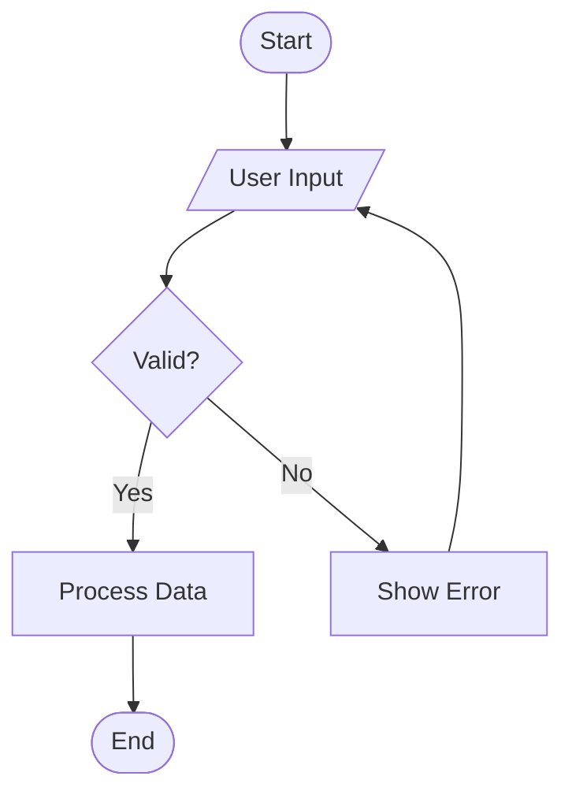

# Diagram Maker Skill

Create beautiful, self-contained diagrams from natural language descriptions using Mermaid.js. Generates standalone HTML files that can be opened in any browser.

## Supported Diagram Types

| Type | Mermaid Keyword | Example Use Case |
|------|----------------|------------------|
| Flowchart | `flowchart TD/LR` | Process flows, decision trees |
| Sequence Diagram | `sequenceDiagram` | API calls, system interactions |
| Class Diagram | `classDiagram` | OOP design, data models |
| State Diagram | `stateDiagram-v2` | State machines, workflows |
| ER Diagram | `erDiagram` | Database schema |
| Gantt Chart | `gantt` | Project timelines |
| Pie Chart | `pie` | Data distribution |
| Git Graph | `gitgraph` | Branch strategies |
| Mindmap | `mindmap` | Brainstorming, concept maps |
| Timeline | `timeline` | Historical events, roadmaps |
| User Journey | `journey` | UX flows |
| Quadrant Chart | `quadrantChart` | Priority matrices |
| Block Diagram | `block-beta` | System architecture |

## Workflow

Make a todo list for all the tasks in this workflow and work on them one after another.

### 1. Understand the Request

Ask clarifying questions if the user's request is ambiguous. Determine:
- **What type of diagram** best fits the request
- **What entities/nodes** are involved
- **What relationships/connections** exist between them
- **Direction preference** (top-down, left-right, etc.)

If the user provides a description like "show me how our auth flow works", analyze the codebase to gather the relevant information before generating the diagram.

### 2. Generate Mermaid Syntax

Write valid Mermaid.js diagram syntax. Follow these rules:
- Use descriptive node IDs (e.g., `authService` not `A`)
- Add labels to connections where meaningful
- Use appropriate shapes for node types (e.g., `([database])`, `{decision}`, `[process]`)
- Keep diagrams readable - break complex ones into subgraphs
- Use proper Mermaid syntax escaping - wrap labels containing special characters in double quotes

**Example flowchart syntax:**


### 3. Create the HTML File

Generate a self-contained HTML file in the `diagrams/` directory at the project root. Use the template below.

**File naming:** `diagrams/<descriptive-name>.html` (e.g., `diagrams/auth-flow.html`, `diagrams/database-schema.html`)

```bash
mkdir -p diagrams
```

**HTML Template:**
```html
<!DOCTYPE html>
<html lang="en">
<head>
    <meta charset="UTF-8">
    <meta name="viewport" content="width=device-width, initial-scale=1.0">
    <title>DIAGRAM_TITLE</title>
    <style>
        * { margin: 0; padding: 0; box-sizing: border-box; }
        body {
            font-family: -apple-system, BlinkMacSystemFont, 'Segoe UI', Roboto, sans-serif;
            background: #f8f9fa;
            min-height: 100vh;
            display: flex;
            flex-direction: column;
            align-items: center;
            padding: 2rem;
        }
        h1 {
            color: #1a1a2e;
            margin-bottom: 0.5rem;
            font-size: 1.8rem;
        }
        .description {
            color: #6c757d;
            margin-bottom: 2rem;
            text-align: center;
            max-width: 600px;
        }
        .diagram-container {
            background: white;
            border-radius: 12px;
            box-shadow: 0 4px 6px rgba(0, 0, 0, 0.07);
            padding: 2rem;
            max-width: 95vw;
            overflow-x: auto;
        }
        .mermaid {
            display: flex;
            justify-content: center;
        }
    </style>
</head>
<body>
    <h1>DIAGRAM_TITLE</h1>
    <p class="description">DIAGRAM_DESCRIPTION</p>
    <div class="diagram-container">
        <pre class="mermaid">
MERMAID_SYNTAX_HERE
        </pre>
    </div>
    <script src="https://cdn.jsdelivr.net/npm/mermaid@11/dist/mermaid.min.js"></script>
    <script>
        mermaid.initialize({
            startOnLoad: true,
            theme: 'default',
            securityLevel: 'loose',
            flowchart: { useMaxWidth: true, htmlLabels: true, curve: 'basis' },
            sequence: { useMaxWidth: true },
            gantt: { useMaxWidth: true }
        });
    </script>
</body>
</html>
```

Replace `DIAGRAM_TITLE`, `DIAGRAM_DESCRIPTION`, and `MERMAID_SYNTAX_HERE` with the appropriate content.

### 4. Validate the Mermaid Syntax

After creating the file, validate the Mermaid syntax by checking for common errors:
- Mismatched brackets or parentheses
- Invalid node IDs (no spaces, no special chars without quotes)
- Missing arrow syntax (`-->`, `==>`, `-.->`)
- Unclosed subgraphs
- Labels with special characters not wrapped in quotes

Review the generated file to confirm the Mermaid syntax is well-formed.

### 5. Commit and Push

Commit the diagram file with a descriptive message and push to the current branch.

## Wrap Up

Provide a summary to the user:

* **Diagram created:** `diagrams/<filename>.html`
* **Type:** The diagram type used (e.g., Flowchart, Sequence Diagram)
* **How to view:** Open the HTML file in any web browser
* **Nodes/entities:** Count of elements in the diagram
* **Description:** Brief summary of what the diagram shows

If the user wants modifications, edit the existing file rather than creating a new one.
